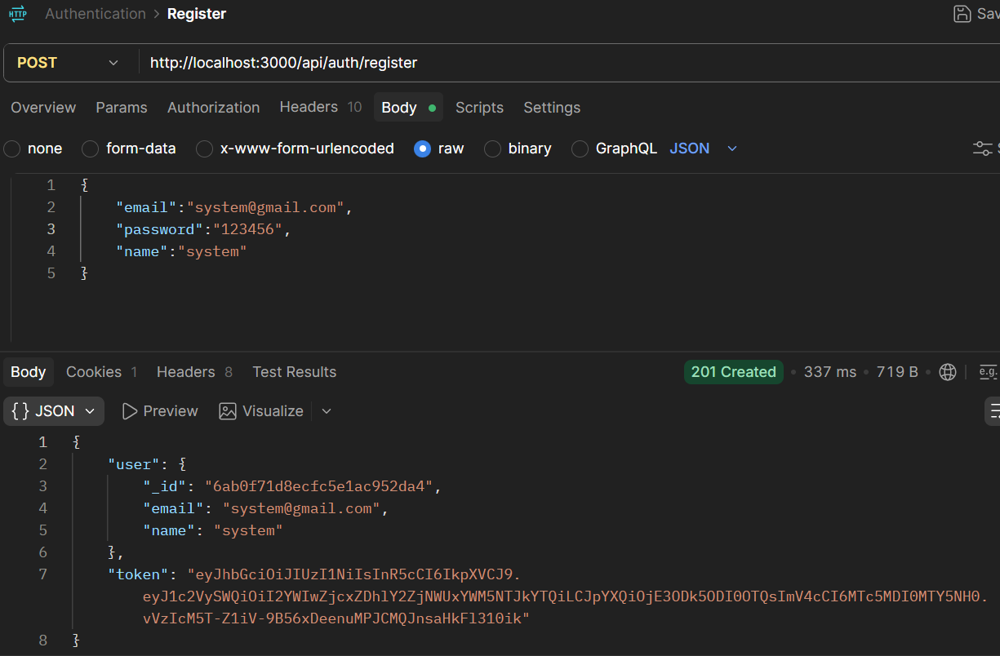
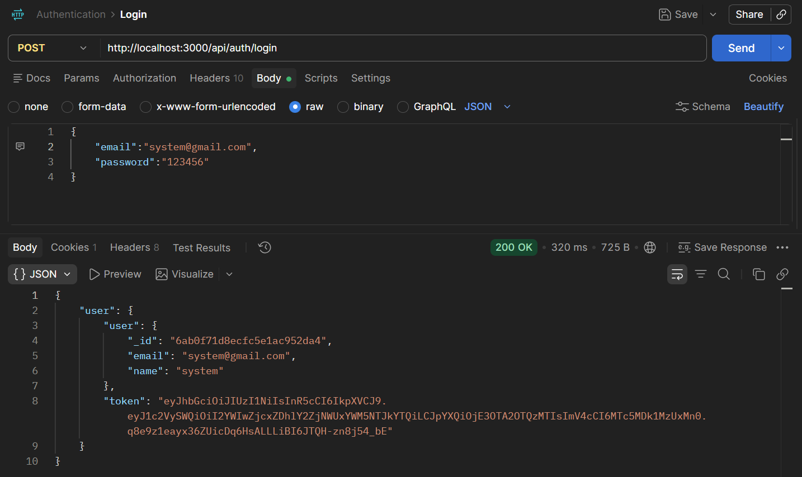
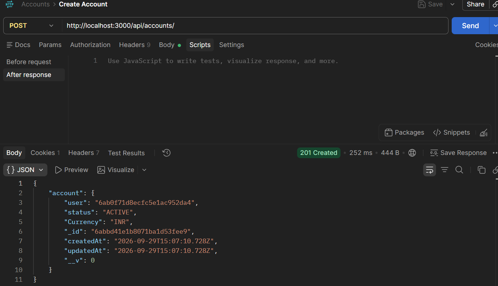
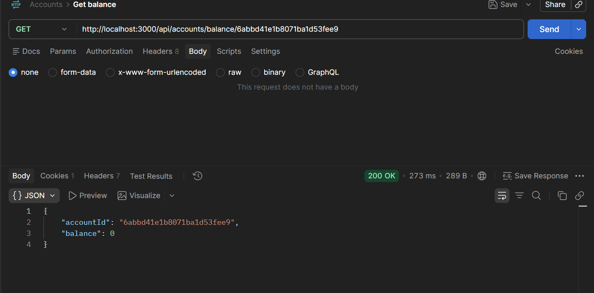
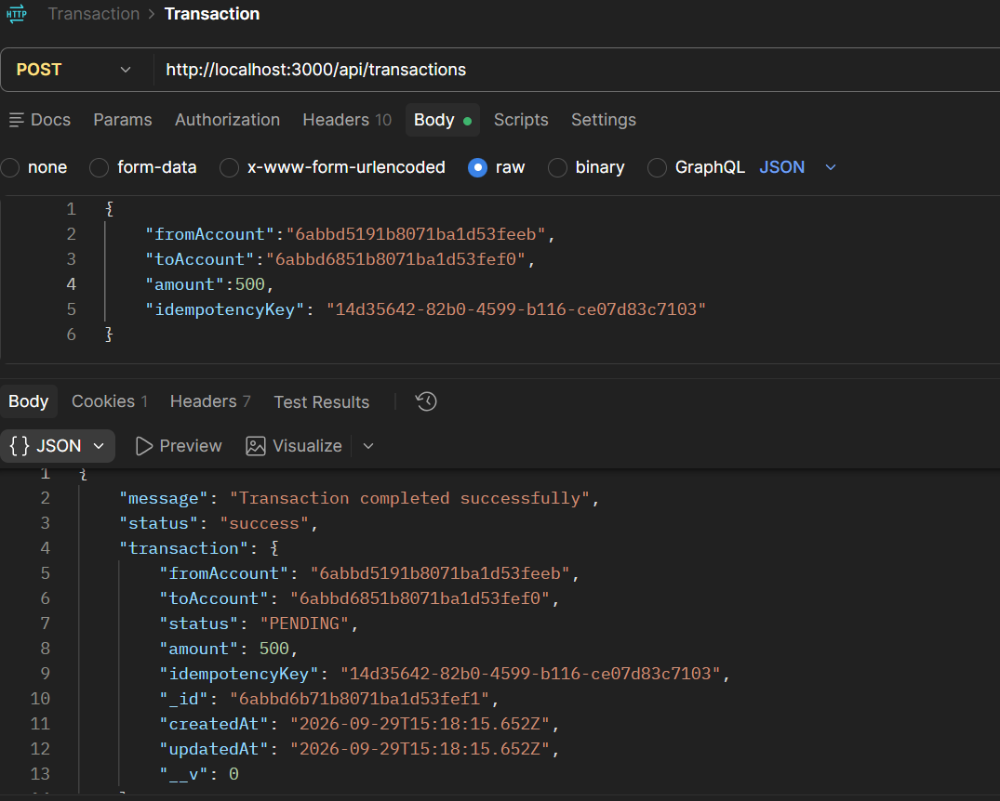
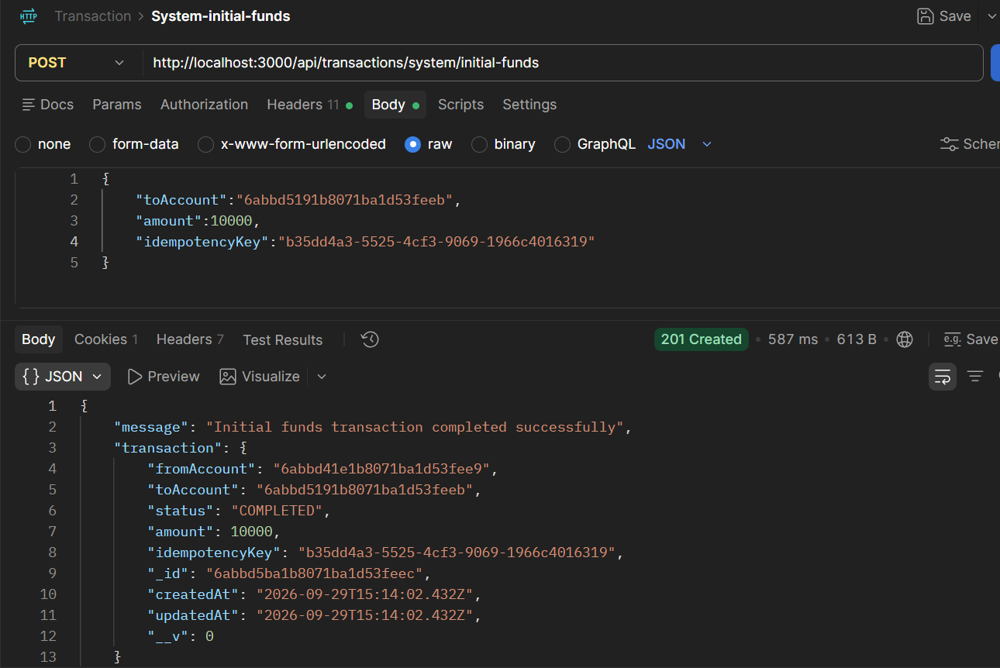
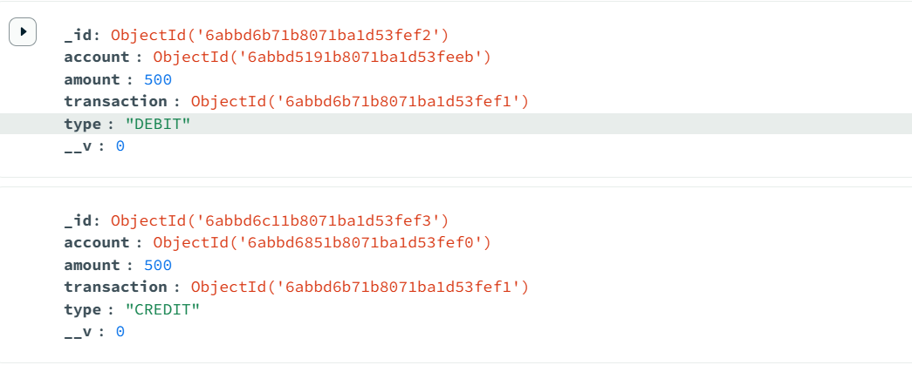

# Backend Ledger

A backend banking and ledger management system built with **Node.js, Express.js, MongoDB, and Mongoose**.

The project implements secure authentication, account management, ledger-based balance calculation, atomic transactions, idempotency, system initial funds, and email service integration.

---

## 🚀 Features

* User registration and login
* JWT-based authentication
* Password hashing using bcrypt
* Account creation and management
* Account status management
* Ledger-based balance calculation
* Debit and credit ledger entries
* Money transfer between accounts
* System initial-fund transactions
* MongoDB transactions for atomic operations
* Idempotency key support
* Transaction status tracking
* Email notification service
* Gmail OAuth2 integration
* Protected API routes

---

## 🛠️ Tech Stack

| Category            | Technologies             |
| ------------------- | ------------------------ |
| Backend             | Node.js, Express.js      |
| Database            | MongoDB, Mongoose        |
| Authentication      | JWT                      |
| Password Security   | bcrypt                   |
| Email Service       | Nodemailer, Gmail OAuth2 |
| API Testing         | Postman                  |
| Database Management | MongoDB Compass          |
| Version Control     | Git, GitHub              |

---

## 📂 Project Structure

```text
backend_banking/
│
├── src/
│   ├── controllers/
│   ├── models/
│   ├── routes/
│   ├── middleware/
│   ├── services/
│   └── app.js
│
├── screenshots/
│   ├── createAccount.png
│   ├── getAccount.png
│   ├── ledger.png
│   ├── register.png
│   ├── login.png
│   ├── transaction.png
│   └── systemInitialFund.png
│
├── .env
├── .gitignore
├── package.json
└── README.md
```

---

## 🔐 Authentication

The application provides secure user authentication using JWT.

### User Registration

Users can register by providing their name, email, and password.



### User Login

After successful login, the authenticated user can access protected APIs using JWT authentication.



---

## 🏦 Account Management

Each user can have a banking account associated with their user profile.

An account contains:

* Account owner
* Account status
* Currency
* Creation timestamp
* Update timestamp

Supported account statuses:

```text
ACTIVE
FROZEN
CLOSED
```

### Create Account



### Get Account



---

## 💰 Balance Management

The project calculates account balance using ledger entries.

```text
Balance = Total Credits - Total Debits
```

The ledger acts as the source of truth for the account balance.

---

## 💸 Transaction System

The project implements a transactional money-transfer flow using MongoDB sessions.

### Transaction Flow

```text
1. Validate Request
        ↓
2. Validate Idempotency Key
        ↓
3. Check Account Status
        ↓
4. Derive Sender Balance from Ledger
        ↓
5. Create Transaction (PENDING)
        ↓
6. Create DEBIT Ledger Entry
        ↓
7. Create CREDIT Ledger Entry
        ↓
8. Mark Transaction as COMPLETED
        ↓
9. Commit MongoDB Transaction
        ↓
10. Send Email Notification
```

### Normal Transaction

A normal transaction transfers money from one active account to another.

```text
Sender Account
      │
      │ DEBIT
      ▼
  Transaction
      │
      │ CREDIT
      ▼
Receiver Account
```



---

## 🔑 Idempotency

The transaction system uses an **idempotency key** to prevent duplicate processing of the same transaction request.

If the same idempotency key is submitted again, the existing transaction is checked instead of creating another transaction.

Supported transaction states:

```text
PENDING
COMPLETED
FAILED
REVERSED
```

This helps prevent duplicate financial transactions caused by repeated API requests.

---

## 🏛️ System Initial Funds

The project supports an initial-funds transaction for transferring funds from a system account to a user account.

```text
System Account
      │
      │ DEBIT
      ▼
  Transaction
      │
      │ CREDIT
      ▼
User Account
```

Example:

```text
System Account
      │
      │ ₹10,000
      ▼
User Account
```



---

## 🧾 Ledger System

Every successful transfer creates two ledger entries:

```text
Sender Account   → DEBIT   ₹500
Receiver Account → CREDIT  ₹500
```

These entries are linked to the same transaction.

### Ledger Entries



The ledger is also used to calculate the current account balance.

---

## 📧 Email Service

The project uses **Nodemailer with Gmail OAuth2** for email notifications.

The email service supports:

* Registration emails
* Successful transaction emails
* Failed transaction emails

Email functionality is separated into a dedicated service layer.

```text
Controller
    ↓
Email Service
    ↓
Nodemailer
    ↓
Gmail OAuth2
    ↓
Recipient
```

---

## 🔄 Transaction Architecture

The complete transaction architecture works as follows:

```text
                 API Request
                      │
                      ▼
                 Validation
                      │
                      ▼
              Idempotency Check
                      │
                      ▼
             Account Validation
                      │
                      ▼
             Balance Verification
                      │
                      ▼
             MongoDB Transaction
                      │
              ┌───────┴───────┐
              ▼               ▼
           DEBIT            CREDIT
           Ledger            Ledger
              │               │
              └───────┬───────┘
                      ▼
            Transaction COMPLETED
                      │
                      ▼
               Commit Session
                      │
                      ▼
             Email Notification
```

---

## ⚙️ Installation

### 1. Clone the Repository

```bash
git clone <YOUR_GITHUB_REPOSITORY_URL>
cd backend_banking
```

### 2. Install Dependencies

```bash
npm install
```

### 3. Configure Environment Variables

Create a `.env` file in the project root:

```env
PORT=3000

MONGO_URI=your_mongodb_connection_string

JWT_SECRET=your_jwt_secret

EMAIL_USER=your_email
CLIENT_ID=your_google_client_id
CLIENT_SECRET=your_google_client_secret
REFRESH_TOKEN=your_google_refresh_token
```

> **Never commit your `.env` file, JWT secret, MongoDB credentials, OAuth client secret, or refresh token to GitHub.**

### 4. Start the Server

Development:

```bash
npm run dev
```

Or:

```bash
npm start
```

The server runs on:

```text
http://localhost:3000
```

---

## 🌐 Deployment

The backend is deployed on **Render**.

**Backend URL:**  
https://backend-ledger-kar1.onrender.com

### Deployment Details

| Configuration | Details |
|---|---|
| Platform | Render |
| Service Type | Web Service |
| Environment | Node.js |
| Start Command | `node server.js` |
| Database | MongoDB |
| Status | Live |

### Production API Example

```http
POST https://backend-ledger-kar1.onrender.com/api/auth/login

## 🧪 API Testing

The APIs can be tested using **Postman**.

### Main API Operations

```text
Authentication
├── Register
└── Login

Accounts
├── Create Account
└── Get Account / Balance

Transactions
├── Create Transaction
└── System Initial Funds

Ledger
└── Ledger Entries
```

---

## 🔒 Security

The project implements several security mechanisms:

* Password hashing using bcrypt
* JWT-based authentication
* Protected API routes
* Account status validation
* Idempotency keys
* MongoDB transactions
* Atomic debit and credit operations
* Environment variables for sensitive credentials
* Gmail OAuth2 authentication

---

## 📌 Future Improvements

* Transaction history pagination
* Advanced transaction filtering
* Transaction reconciliation
* Improved audit logging
* API rate limiting
* Automated unit and integration tests
* Swagger/OpenAPI documentation
* Production deployment
* Monitoring and logging

---

## 👨‍💻 Author

**Krishnkant Modi**

Backend banking and ledger management project demonstrating:

* Backend development
* REST API design
* MongoDB transactions
* Ledger-based accounting
* JWT authentication
* Idempotent transaction processing
* Email service integration
